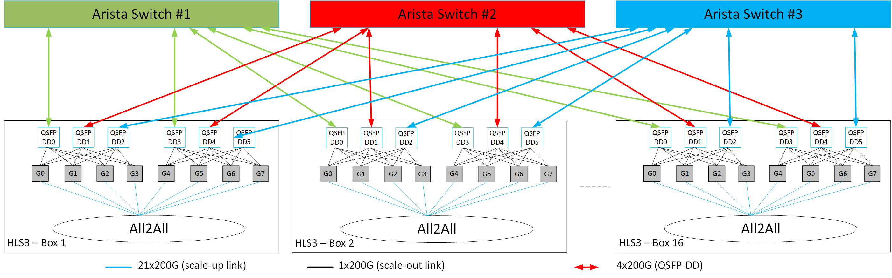

.. _perftest_tool:

.. |Version| replace:: v1.21.3

******************************
Intel Gaudi RDMA PerfTest Tool
******************************

This document provides guidelines for installing and running the Intel® Gaudi® RDMA PerfTest tool
:code:`habanalabs-perf-test` on Gaudi accelerator. This tool is designed for
low-level, high-performance testing of connectivity through ping-pong, bandwidth, and latency
communication tests. It utilizes the Reliable Connection (RC) method and RDMA Write
operations to deliver performance measurements.

   .. note::
      - The tool is only supported on Gaudi 3 and Gaudi 2, and can be used only with their NICs.
      - The tool can only be used in a container and is not supported on a VM.

   .. --->

Prerequisites
=============

- :code:`perftest`

For more information about perftest application, see `PerfTest README <../README.md>`_.

   .. note:: If you have upgraded to the |Version| software version, the above packages are already
      included, and no additional installation is required.

   .. --->

Options and Usage
==================

RDMA PerfTest tool is executed using :code:`cloud_run.py` Python wrapper script. It runs across an entire data center, covering all pairwise permutations for thorough evaluation.

The following port connectivity options are supported for testing on multiple nodes:

   .. note:: PerfTest tool supports L2 topology connectivity (two nodes with one switch).

   .. --->

Prerequisites
-------------

The below lists the prerequisites needed to run the :code:`cloud_run.py` Python wrapper script:

- Install the requirements file:

    .. code::

        pip install -r requirements.txt

- Make sure all tested nodes have SSH keys configured for seamless access. The script relies on
  SSH sessions established via SSH keys.

   .. note:: Starting from 1.18.0 release, SSH host keys have been removed from Dockers.
    To add them, make sure to run :code:`/usr/bin/ssh-keygen -A` inside the Docker container.
    If you are running on Kubernetes, make sure the SSH host keys are identical across all Docker containers.
    To achieve this, you can either build a new Docker image on top of Intel Gaudi Docker image by adding
    a new layer :code:`RUN /usr/bin/ssh-keygen -A`, or externally mount the SSH host keys.

    .. --->

- Make sure all tested nodes added to the SSH known hosts file.

- Verify that all external NIC ports are active and accessible on each node. For more details, see `Disable Enable NICs <https://docs.habana.ai/en/latest/Management_and_Monitoring/Embedded_System_Tools_Guide/Disable_Enable_NICs.html#disable-enable-nics>`_.

- Prepare a host file listing all tested nodes with their SSH connection details (IP and port). Use the following format: SSH-IP:SSH-PORT. For example:

   .. code::

      kuku-kvm12-lake:22
      kuku-kvm13-lake:22
      kuku-kvm14-lake:22
      kuku-kvm15-lake:22

- Configure :code:`config.sh` script on for all tested nodes by implementing the following:

  1. Write the :code:`LD_LIBRARY_PATH` environment variable to a file. This ensures it can be accessed in remote SSH sessions during testing:

     .. code::

        echo "LD_LIBRARY_PATH=${LD_LIBRARY_PATH}" | tee ~/.ENV_SCALEUP

  2. Create :code:`gaudinet.json` file and configure it as described in the `Generating Gaudinet JSON <https://docs.habana.ai/en/latest/Management_and_Monitoring/Network_Configuration/Configure_E2E_Test_in_L3.html#generating-gaudinet-json>`_ section.
     Once done, set file the path by running the below:

     .. code::

        echo "GAUDINET_PATH=<PATH/TO/guadinet.json>" | tee -a ~/.ENV_SCALEUP

  3. (:code:`ping-pong` and :code:`write_bw` tests only) Create :code:`server_internal_connectivity.csv` file and configure it as described in `Internal Ports Testing`_.
     Once done, set the file path by running the below:

     .. code::

        echo "SERVER_INTERNAL_CONNECTIVITY_PATH=<PATH/TO/server_internal_connectivity.csv>" | tee -a ~/.ENV_SCALEUP

  4. Apply the script for all tested nodes:

     .. code::

        bash ./config.sh

.. _internal_testing:

Internal Ports Testing
~~~~~~~~~~~~~~~~~~~~~~~~~~

   .. note:: The internal ports testing is supported for :code:`ping-pong` and :code:`write_bw` tests only.

   .. --->

To perform testing on the internal ports, follow the steps below:

1. Review example configurations of the :code:`server_internal_connectivity.csv` file in the :code:`internal_data` folder.
   The example shows the internal NIC connectivity map tables. Verify if any of these configurations match your server setup.
   If a configuration matches, use it for your setup.

2. If none of the examples match your configuration, create a new internal NIC port connectivity map in CSV format using the following template:

   .. code::

      <source-device-module-id>,<source-port-number>,<destination-device-module-id>,<destination-port-number>

   .. --->

      .. note:: In the CSV file, every module ID present on the server must appear in the source-device-module-id column. For example,
         if module OAM_i is connected to module OAM_j, the CSV should include the following:
         .. code::
            i,0,j,1
            j,1,i,0

      .. --->

3. Add the :code:`--internal` switch after :code:`perftest` in the tool command line as shown in `Test-specific Options`_.

Python Wrapper Options
-----------------------

Use the :code:`-h` argument to view all options.
The table below describes all the :code:`cloud_run.py` options available.

+---------------------------------+---------------------------------------------------------+
| Option                          | Description                                             |
+=================================+=========================================================+
| :code:`-h, --help`              | Shows the help message and exits                        |
+---------------------------------+---------------------------------------------------------+
| :code:`-hf, --host_file`        | Sets path to a host_file that includes a host IP list   |
+---------------------------------+---------------------------------------------------------+
| :code:`-skf, --ssh_key_file`    | Sets SSH private key file path                          |
+---------------------------------+---------------------------------------------------------+
| :code:`-khf, --known_hosts_file`| custom SSH known hosts file path                        |
|                                 | (default: ~/.ssh/known_hosts)                           |
+---------------------------------+---------------------------------------------------------+
| :code:`-o, --output`            | Saves all the log files in a specific path (the flag    |
|                                 | must be set, and be absolute path)                      |
+---------------------------------+---------------------------------------------------------+

PerfTest Options
-----------------

Use the :code:`-h` argument to view all options.
The table below describes all the :code:`perftest` options available.

+---------------------------------------------------------+------------------------------------------------------------+
| Option                                                  | Description                                                |
+=========================================================+============================================================+
| :code:`-h, --help`                                      | Shows the help message and exits                           |
+---------------------------------------------------------+------------------------------------------------------------+
| :code:`-tp, --tcp_port`                                 | Specifies the TCP port range script will use (default:1100)|
+---------------------------------------------------------+------------------------------------------------------------+
| :code:`-int, --internal`                                | Enables internal NIC ports testing. Only supported with    |
|                                                         | ping-pong and write_bw tests.                              |
+---------------------------------------------------------+------------------------------------------------------------+
| :code:`-dis_rem_ext_tes, --disable_remote_external_test`| Disables :code:`remote external` NIC ports testing.        |
|                                                         |                                                            |
+---------------------------------------------------------+------------------------------------------------------------+
| :code:`-bs, --basic_check`                              | Enables testing between the corresponding ports across     |
|                                                         | two systems. The ports are tested one by one in matching   |
|                                                         | pairs. For example, port 0 with port 0, port 1             |
|                                                         | with port 1, etc.                                          |
+---------------------------------------------------------+------------------------------------------------------------+
| :code:`-tl, --test_local`                               | Tests all the internal routes between all existing Gaudis  |
|                                                         | in the node. Only external NICs are tested.                |
+---------------------------------------------------------+------------------------------------------------------------+

.. _test-options:

Test-specific Options
----------------------

Use the :code:`-h` argument to view all options.
The tables below describe all the testing options available.

Ping-pong Test (:code:`ping-pong`)
-----------------------------------

   +-------------------------------------+----------------------------------------------------------+
   | Option                              | Description                                              |
   +=====================================+==========================================================+
   | :code:`-h, --help`                  | Shows the help message and exits                         |
   +-------------------------------------+----------------------------------------------------------+
   | :code:`-s, --size`                  | Sets size of message to exchange (default: 4096)         |
   +-------------------------------------+----------------------------------------------------------+
   | :code:`-r, --rx_depth`              | Sets number of receives to post at a time (default: 128) |
   +-------------------------------------+----------------------------------------------------------+
   | :code:`-n, --iters`                 | Sets number of exchanges (default: 10)                   |
   +-------------------------------------+----------------------------------------------------------+
   | :code:`-c, --chk`                   | Validates received buffer                                |
   +-------------------------------------+----------------------------------------------------------+

   **Example:**

   .. code::

      python3 ./cloud_run.py --host_file ./hostfile --output /tmp/output perftest --internal --basic_check --tcp_port 1100 ping_pong --size 4096 --rx_depth 128 --iters 10 --chk

Bandwidth Test (:code:`write_bw`)
----------------------------------

   +-------------------------------------+--------------------------------------------------------------------------+
   | Option                              | Description                                                              |
   +=====================================+==========================================================================+
   | :code:`-h, --help`                  | Shows the help message and exits                                         |
   +-------------------------------------+--------------------------------------------------------------------------+
   | :code:`-s, --size`                  | Sets size of message to exchange (default: 1048576)                      |
   +-------------------------------------+--------------------------------------------------------------------------+
   | :code:`-r, --rx_depth`              | Sets number of receives to post at a time (default: 128)                 |
   +-------------------------------------+--------------------------------------------------------------------------+
   | :code:`-n, --iters`                 | Sets number of exchanges (default: 100000 for Gaudi 3, 50000 for Gaudi 2)|
   +-------------------------------------+--------------------------------------------------------------------------+
   | :code:`-c, --criteria`              | Sets pass/fail criteria value for the test threshold in Gbps             |
   |                                     | (default: not used)                                                      |
   +-------------------------------------+--------------------------------------------------------------------------+

   **Example:**

   .. code::

      python3 ./cloud_run.py --host_file ./hostfile --output /tmp/output perftest --internal --basic_check --tcp_port 1100 write_bw --size 1048575 --rx_depth 128 --iters 100000

Latency Test (:code:`write_lat`)
---------------------------------

   +-------------------------------------+----------------------------------------------------------+
   | Option                              | Description                                              |
   +=====================================+==========================================================+
   | :code:`-h, --help`                  | Shows the help message and exits                         |
   +-------------------------------------+----------------------------------------------------------+
   | :code:`-s, --size`                  | Sets size of message to exchange (default: 1024)         |
   +-------------------------------------+----------------------------------------------------------+
   | :code:`-r, --rx_depth`              | Sets number of receives to post at a time (default: 128) |
   +-------------------------------------+----------------------------------------------------------+
   | :code:`-n, --iters`                 | Sets number of exchanges (default: 500000)               |
   +-------------------------------------+----------------------------------------------------------+
   | :code:`-c, --criteria`              | Sets pass/fail criteria value for the test threshold in  |
   |                                     | ms (default: not used)                                   |
   +-------------------------------------+----------------------------------------------------------+

   **Example:**

   .. code::

      python3 ./cloud_run.py --host_file ./hostfile --output /tmp/output perftest --basic_check --tcp_port 1100 write_lat --size 1024 --rx_depth 128 --iters 100000

**Expected output:**

.. code:: sh

  * CloudReport_<timestamp>.txt - Tested nodes summary.
  * <server_host_name>_<client_host_name>
    └── scaleUpRepor_<timestamp>.txt - Specific server and client pair summary.
    └── perftest
      └── <network_ip>
        └── <server - device (ib_dev)>
          └── <device_port (ib_port)>
            └── <client - device (ib_dev)>
              └── <device_port (ib_port)>.txt - Both device application prints.

The output is saved in the output directory in a timestamp-named folder.

Licensing
=========

Copyright (c) 2022 Habana Labs, Ltd.

SPDX-License-Identifier: MIT